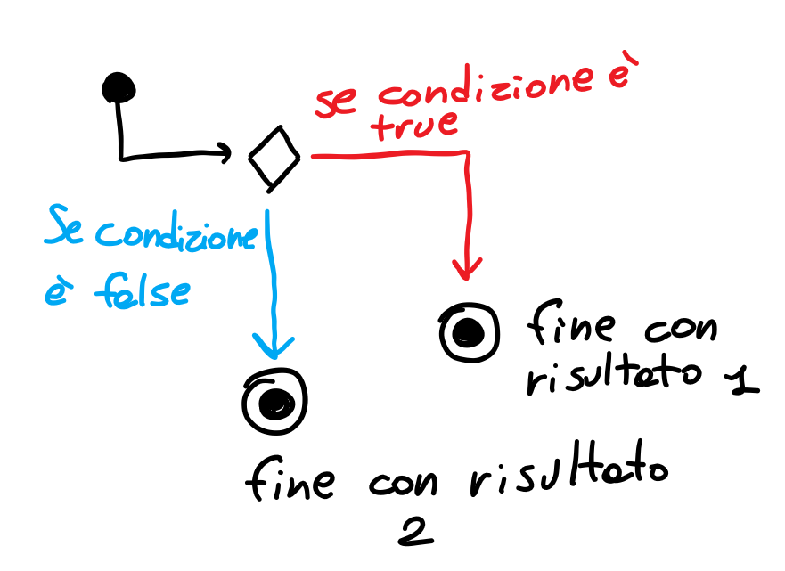

# L'analisi della RAM
Propants sta creando una mod per ottimizzare i blocchi di Minecraft.
Deve verificare se la RAM usata è dispari **e** se gli FPS attuali sono inferiori a 30!

# Ritorno condizionale

Questo è un concetto molto importante:

```java
if(condizione) {
    return 1; // il return viene raggiunto solo se condizione è true!
} // se condizione è false, salta qui! Quindi arriverà a return 2
return 2;
```

Il return è un operazione speciale: serve a bloccare la funzione in quel punto! Una volta che il codice ha incontrato un return, si ferma. Quello è il risultato.

