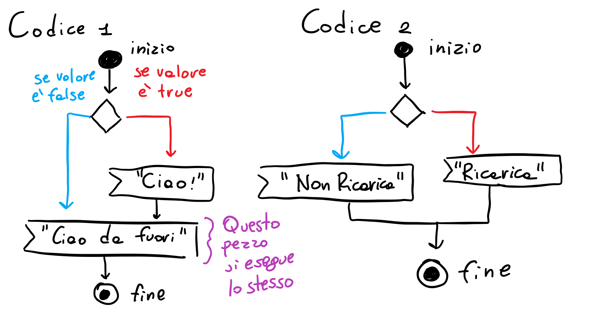
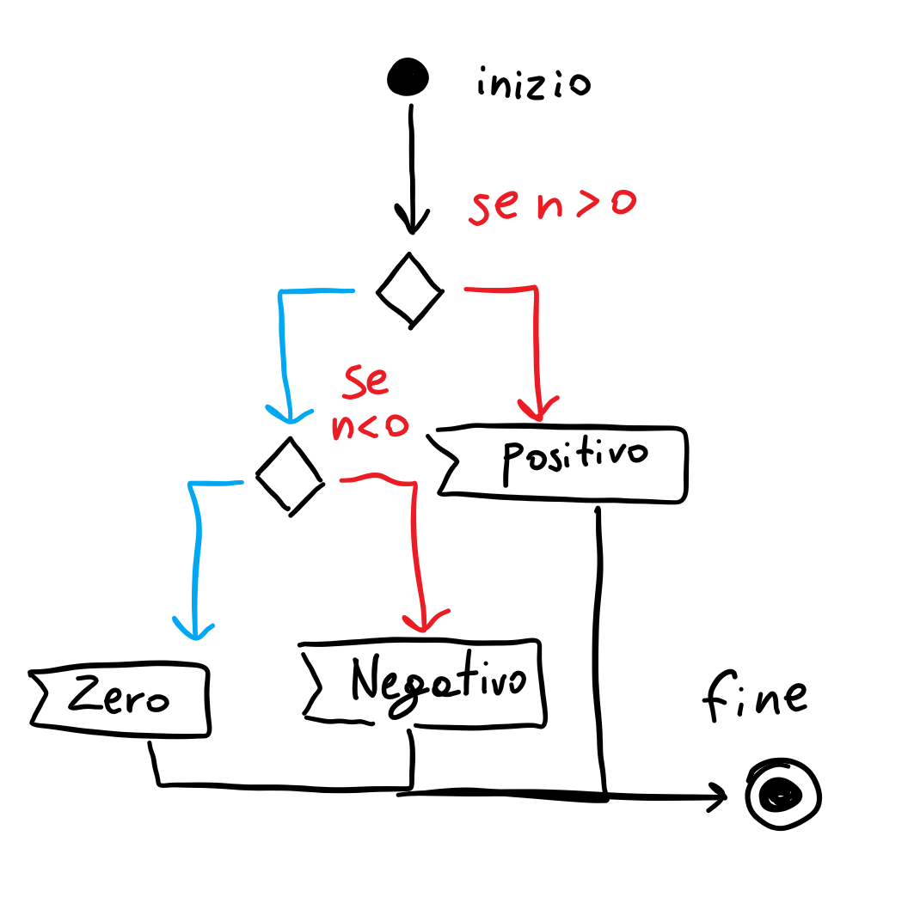

# Lezione 1

## Comparatori
Si possono usare per **tutti** i tipi di variabile **primitiva**

### Equals
Controlla se a e b sono uguali, e se lo sono mette true, altrimenti false
```java
int a = ...;
int b = ...;
boolean r = a == b;
```

### Not equals
Comtrolla se a e b sono diversi, e se lo sono mette true, altrimenti false
```java
int a = ...;
int b = ...;
boolean r = a != b;
```

Esistono alcuni comparatori che si possono eseguire sui numeri esclusivamente
```java
int a = ...;
int b = ...;

boolean maggiore = a > b;
boolean minore = a < b;
boolean maggioreUguale = a >= b;
boolean minoreUguale = a <= b;
```

## Porte logiche

### NOT
Inverte il segnale
```java
boolean b = !a;
```

| IN    | OUT   |
|-------|-------|
| True  | False |
| False | True  |

### AND
Si accende SOLO se ENTRAMBI sono accesi
Si accende se a E b sono accesi
```java
boolean r = a && b;
```

| A     | B     | R     |
|-------|-------|-------|
| False | False | False |
| False | True  | False |
| True  | False | False |
| True  | True  | True  |

### OR
Si accende se ALMENO UNO è acceso
Si accende se a O b sono accesi
```java
boolean r = a || b;
```

| A     | B     | R     |
|-------|-------|-------|
| False | False | False |
| False | True  | True  |
| True  | False | True  |
| True  | True  | True  |

### XOR
Si accende solo se i due valori sono diversi
```java
boolean r = a ^ b;
```

| A     | B     | R     |
|-------|-------|-------|
| False | False | False |
| False | True  | True  |
| True  | False | True  |
| True  | True  | False |

## Operatore resto
```java
int c = a % b; // Ti dà il resto della divisione a/b
```

## Percorsi logici
Servono a dire al programma di fare qualcosa solo SE una condizione è vera

```java
boolean valore = ...; // true o false
if(valore) {
    System.out.println("Ciao!"); // Verrà eseguito SOLO se "valore" è true!    
}
System.out.println("Ciao da fuori!") // Questo verrà eseguito sempre!
```

Output atteso:

Se valore è true:
```
Ciao!
Ciao da fuori!
```
Se valore è false:
```
Ciao da fuori!
```

Possiamo quindi decidere di creare un "percorso" che il nostro programma segue

```java
boolean batteriaScarica = ...;

if(batteriaScarica) { // Se la batteria è scarica
    System.out.println("Si deve ricaricare la batteria!!");
}
if(!batteriaScarica) { // Se la batteria NON è scarica
    System.out.println("La batteria sta bene!");
}
```

Output atteso:
Se batteriaScarica è true:
```
Si deve ricaricare la batteria!!
```
Se batteriaScarica è false:
```
La batteria sta bene
```

Vediamo dunque il percorso che questi ultimi due codici seguono



Vediamo però come scrivere bene il codice 2, nel prossimo pezzo

## Else, else if

Nel codice 2 precedente, abbiamo usato un secondo if ma con un not per creare il percorso inverso.
Possiamo comprimere questa cosa con un semplice "else"

```java
boolean batteriaScarica = ...;
if(batteriaScarica) {
    System.out.println("Batteria scarica!");
} else {
    System.out.println("Batteria carica!");
}
```

Il ragionamento è identico, ma ovviamente il codice è più compatto e più veloce!

Vediamo ora l'if-else e cosa ci permette di fare

```java
int n = ...;
if(n > 0) {
    System.out.println("Il numero n è positivo!");
} else if(n < 0) {
    System.out.println("Il numero n è negativo!");
} else {
    System.out.println("Il numero n è zero!");
}
```

In questo caso abbiamo 3 percorsi che il progamma può scegliere, ma il percorso è più complesso di quanto sembra


