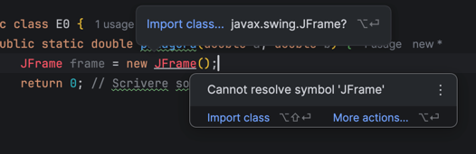

# Teorema di pitagora

Conosci bene il teorema di pitagora, no?
$$
\sqrt{a^2 + b^2}
$$

Come vedi abbiamo bisogno di due operazioni che fino ad ora non abbiamo ancora visto.

In realtà andremo a vedere ora solo la radice, poichè abbiamo già una formula per eseguire la potenza per 2:
$$
a^2=a \times a
$$

Per fare questo andremo ad usufruire della libreria `Math`, e in particolare la funzione `sqrt` (square root)


## Import
Andiamo a studiare un attimo quello che troviamo nella nostra classe `E0` prima della nostra funzione:

```java
package l3.l0; //<--- Cartella attuale

// [...] Resto del codice
```

Il package serve a specificare che questa classe si trova dentro la cartella (che per l'appunto in java viene chiamato package) `l3.l0`.
In formale si dice che `E0` si trova nel package `l3.e0`

Quando lavoriamo in java, anche se il nostro codice contiene solo 2 file java, il pacchetto include molteplici altri package (chiamati `librerie`, `lib`) che contengono tantissime funzioni.

Quella con cui lavoreremo oggi è `java.lang`

```java
package l3.l0;

import java.lang.Math;

//[...] Resto del codice
```

Abbiamo ora detto al codice di importare la classe `Math` che si trova dentro `java.lang`

Intellij IDEA ci semplifica tutto: ha un sistema automatico di importazione delle librerie e di ottimizzazione, ma è importante comprenderne il significato quando si vedono errori.



Come puoi vedere IDEA ci consiglia di importare la classe quando riconosce che ne esiste una

Tenendo premuto `CTRL` e cliccando su Math, è possibile aprire la classe e leggerne il codice, e quindi tutte le funzioni. Andiamo a vedere come fare la radice quadrata:

```java
double q = Math.sqrt(a); // Fa la radice quadrata di a
```

Come vedi abbiamo detto al codice `Cerca dentro Math la funzione sqrt()`, `che deve avere un argomento double e ritornare un double`, e eseguila mettendo come argomento `a`.

Possiamo quindi immaginare che dentro `Math.java` avremmo una funzione del tipo:

```java
public static double sqrt(double a) {
    // Resto del codice
}
```

Tuttavia, se non avessimo messo l'import all'inizio, il nostro codice non avrebbe potuto sapere dove si trova `Math.java` (anche perché in software molto grandi poteebbero esserci più classi con lo stesso nome)


## Caller e Callee
Come puoi vedere, noi non abbiamo scritto il codice di `sqrt`. Si tratta di una funzione già scritta da qualcun'altro, e che noi utilizziamo.

Noi siamo dunque definiti Caller (Chiamante) o Cliente della funzione, e ci limitiamo a sfruttarla.

Questa è la base della modularità del codice: Anche se un giorno java decidesse di modificare la funzione sqrt (per motivi di ottimizzazione), la definizione rimane identica e cambia solo la logica interna, e quindi non c'è bisogno che noi modifichiamo il codice.